# Architecture

```mermaid
flowchart LR
    subgraph W1["W1 - Simulated World and Ground Truth - raul"]
        M1[Merchant simulator A<br/>native shape A]
        M2[Merchant simulator B<br/>native shape B]
        M3[Merchant simulator C<br/>native shape C]
        M4[Merchant simulator D<br/>native shape D]
        Raw[Raw Kafka topics]
        Inject[Incident injection point]
        Truth[(Hidden ground truth store)]
        M1 --> Raw
        M2 --> Raw
        M3 --> Raw
        M4 --> Raw
        Inject --> M1
        Inject --> M2
        Inject --> M3
        Inject --> M4
        M1 -.-> Truth
        M2 -.-> Truth
        M3 -.-> Truth
        M4 -.-> Truth
    end

    subgraph W2["W2 - Detection Plane - andres"]
        Registry[Schema registry<br/>JSON Schema normalisation]
        Canonical[Canonical event stream]
        Store[(Non-relational document store<br/>product undecided)]
        Aggregate[Rolling aggregation]
        Baseline[Baselines]
        Cohort[Cohort localisation<br/>arbitrary dimension combinations]
        Severity[Severity and financial impact]
        Detect[Deterministic detection]
        Incidents[Incident records]
        Raw --> Registry --> Canonical
        Canonical --> Store
        Canonical --> Aggregate --> Baseline --> Cohort --> Detect
        Store --> Cohort
        Detect --> Severity --> Incidents
        Store --> Incidents
    end

    subgraph W3["W3 - Investigation and Integration - derek"]
        Investigator[Headless Pi investigation agent]
        Evidence[Evidence-query scripts]
        External[External corroboration]
        Result[Investigation result]
        Catalogue[Scenario catalogue]
        Evaluator[Evaluator]
        Incidents --> Investigator
        Store --> Evidence --> Investigator
        External --> Investigator
        Investigator --> Result
        Truth -.-> Evaluator
        Result -. diagnosis only .-> Evaluator
    end

    subgraph W4["W4 - Surfaces and Escalation - juank"]
        Dashboard[Dashboard]
        Slack[Slack]
        Phone[Phone escalation]
        Result --> Dashboard
        Incidents --> Dashboard
        Result --> Slack
        Result --> Phone
    end

    Inject -. judge trigger .-> W1
    Evaluator -. verdict only .-> Dashboard
```



Merchant simulators publish genuinely heterogeneous native events to raw Kafka topics. The schema registry is the normalisation boundary and emits one canonical event stream.
The canonical representation is persisted in a non-relational document store and is the consistent model used by downstream workflows.
Detection consumes the canonical topic for rolling aggregates and uses the document store as its query surface.
The deterministic detection plane computes baselines, cohort localisation, severity and financial impact, then writes incident records.
Confounding detection is computed in this plane rather than reasoned about by the investigation agent.
Kafka consumer lag supplies real queue-depth and retry-amplification evidence from the running pipeline, not a modelled one.
The investigation agent reads incidents and queries evidence through W2-provided scripts, with external corroboration feeding its analysis.
It returns an investigation result with narrative and diagnostic confidence; it does not recompute raw-event metrics.
Dashboard, Slack and phone escalation consume the incident and investigation surfaces.
The judge trigger reaches W1's incident injection point, while hidden ground truth remains quarantined from detection and investigation.
Only the evaluator receives hidden ground truth and compares it with the diagnosis after the fact.
The specific document-store product remains an open decision; no product is implied by this diagram.
```