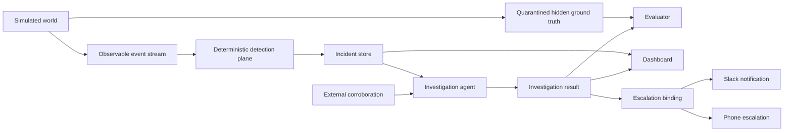

# Architecture

This shows the settled product architecture. The technology choices behind each node are open.
Node boundaries correspond to the workstreams in [`docs/ownership.md`](docs/ownership.md).
