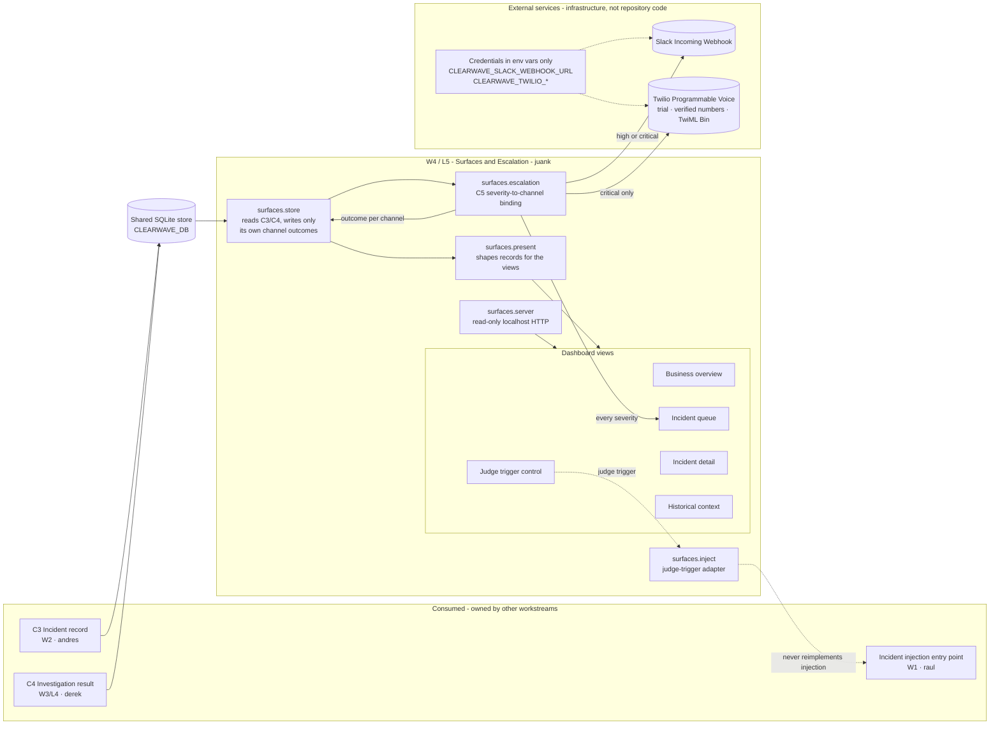

# W4 / L5 - Surfaces and Escalation: component architecture

`ARCHITECTURE.md` draws the whole system and shows W4 as three boxes: Dashboard, Slack, Phone.
This document zooms into those boxes. It exists because the *wiring* of the two external channels -
which module builds which payload, what protocol carries it, where the credentials live, and what
happens when a channel fails - is implementation detail internal to W4, not a cross-workstream
decision, so it does not belong in the root diagram.

Owner: `juank`. Every module named here lives in `surfaces/`.

## The diagram

## Why it is wired this way

**W4 reads the store W2 and W3 already write; it never builds a second read model.** `surfaces.store`
opens the same SQLite file the detector and the investigation runner use, located by `CLEARWAVE_DB`.
The only rows W4 writes are its own escalation outcomes. A parallel read model would eventually
disagree with the detector about what happened, and the disagreement would surface in front of a
judge rather than in a test.

**Severity decides the channel, and severity is never recomputed.** The binding lives in
`surfaces/escalation.py` and is specified in [`docs/contracts/notification-escalation.md`](contracts/notification-escalation.md).
Diagnostic confidence never enters this decision: it is C4's assessment of evidence strength, while
severity is C3's assessment of business impact, and collapsing them would let a well-understood small
incident outrank a catastrophic ambiguous one.

**Both external channels are fire-and-forget with a recorded outcome.** A channel that is slow,
misconfigured, or down records a failed outcome and returns; it never blocks the dashboard, never
fails an incident, and never raises. PRD section 29 requires exactly this: if Slack fails the
dashboard still works, and if the phone call fails the diagnosis still works.

**Credentials never enter the repository.** Both channels read their credentials from environment
variables at call time. Nothing is committed, and a missing credential degrades that one channel to a
recorded "not configured" outcome rather than a crash.

**Twilio needs a TwiML Bin, not inline TwiML.** Trial accounts reject the inline `Twiml` parameter on
the Calls API, so the call points at a URL Twilio already hosts. The TwiML is a bounded silent
`<Pause>`: a trial account prepends its own spoken announcement before any TwiML runs regardless, so
a spoken script would be talked over. The requirement in PRD section 19 is that the call *happens*
for a critical incident - the call occurring is the signal, not its audio.

**The judge trigger is W4's control but W1's mechanism.** `surfaces.inject` is an adapter only. It
must never reimplement injection and must never pass a scenario identifier toward detection or
investigation, per ADR 0012.
