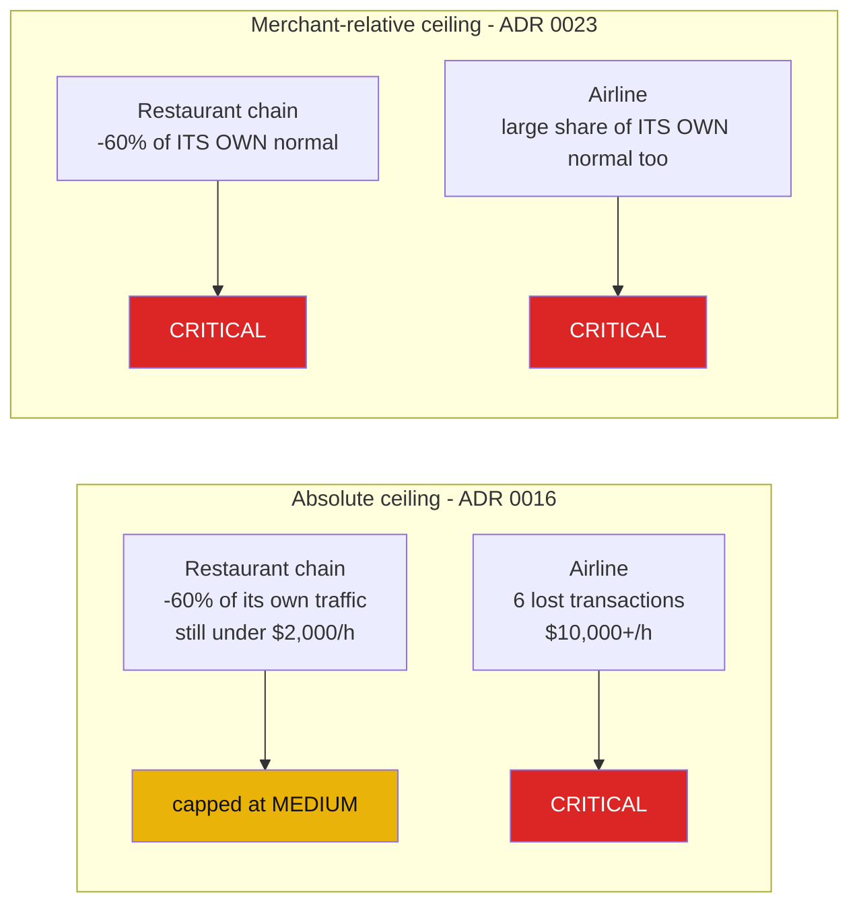
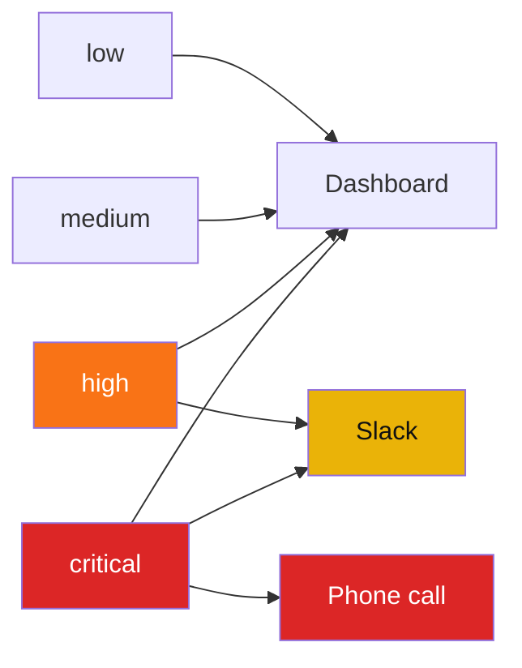
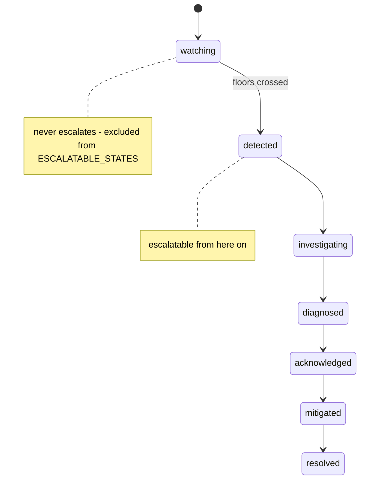
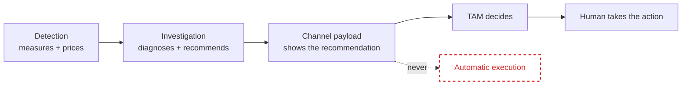

# Decision log

Deliverable 5 of `docs/challenge.md`: "alternatives considered and why you chose what you chose."
Judging criterion 2 asks it directly - can the team explain every major decision, the alternatives
rejected, and why; does the log show real trade-offs.

**How to read this.** This file is a curated index over an existing decision trail, plus the summarised
records for the one layer that never had any. Most rows below link out to an existing ADR in
[`docs/adr/`](adr/README.md), each in the same Status/Context/Decision/Alternatives
considered/Consequences format. W4 (surfaces and escalation) had zero ADRs before this document, so
its three new records - 0027, 0028 and 0029 - are summarised **in the appendix at the bottom of this
same file**, each with a diagram of the rule it states, rather than split into separate files; every
row that cites them links to that appendix. Rows without an ADR cite a timestamped entry in
[`DECISIONS.md`](../DECISIONS.md) instead -
that file is append-only and union-merged across four contributors on independent machines, so its
timestamp is the only sort key and a superseded entry is never deleted, only followed by a later one.
Where this document states a reason, that reason is copied from one of those sources or from a code
comment cited alongside it - nothing here is invented. `DECISIONS.md`'s own rule for the team states
that directly: "an agent may capture what was decided and when, but never the reasoning"
(2026-08-26T23:43Z).

A reversal is kept in this log, not smoothed over. Eight of them are their own section below, because
"what did you change your mind about, and why" is a stronger answer under Q&A than a project that
claims it got everything right the first time.

## Product and scope

| Decision | We chose | We rejected | Because | Cost accepted | Record |
| --- | --- | --- | --- | --- | --- |
| Challenge pick | Challenge 02, Control Tower | Any other 2026 challenge | Final under event protocol SYS.A, cannot be revisited | Every workstream commits before the stack does | `DECISIONS.md` 2026-08-29T16:52Z |
| What the system does | Detect, diagnose, explain, recommend | Auto-remediate production systems | Challenge brief: diagnose, don't remediate; a wrong automatic action on live traffic outweighs a missed one | No one-click fix, ever - the TAM stays the actor | `docs/challenge.md:77-78`, PRD §23, [ADR 0029](#adr-0029) |
| Severity vs. confidence | Two independent axes | One collapsed risk score | A critical incident with low confidence is valid required output; collapsing hides that a diagnosis is shaky | Harder UI - two numbers to read, not one | ADR 0002, `DECISIONS.md` 2026-08-29T18:09Z |
| Investigation failure | Render the incident, mark the narrative unavailable | Drop the incident from the board | Losing a real incident because a model call failed is worse than an honest gap | The board sometimes shows "cause unavailable" | ADR 0010, `DECISIONS.md` 19:17Z |
| Demo scope | Three guaranteed scenarios, rest documented only | Promise every scenario in `docs/scenarios.md` | Rehearsal time and reliability under freeze pressure | Some documented scenarios are untested on stage | `DECISIONS.md` 19:17Z |

## Stack and transport

| Decision | We chose | We rejected | Because | Cost accepted | Record |
| --- | --- | --- | --- | --- | --- |
| Transport | Real Kafka + Schema Registry | An in-process queue / simplified transport | "kafka por que es el estandar para una cola de mensajes y comunicación entre ms" (raul) | Docker/broker dependency for the live path; a broker-free fallback exists for exactly this reason | `DECISIONS.md` 2026-08-29T18:39Z |
| Persistence | Relational SQLite, one file | A non-relational document store | Simpler, more deterministic; one file every layer reads is what stops two components giving two answers to one question | No horizontal write scaling; a single-writer store | `DECISIONS.md` 19:17Z, reversing the 19:04Z document-store call |
| Store location | One `CLEARWAVE_DB` env var, defaulting to `state/clearwave.db` | Per-service stores or a shared network service | Every consumer reading the same file is the whole point of the SQLite call | Nothing distributed; the store is one machine's disk | `DECISIONS.md` 20:32Z |
| Empty-store behaviour | Honest zeros/nulls/empty lists | Fail or refuse to answer | An unseeded store is a real, well-formed state, not an error condition | Every tool must be written to prove correctness on nothing | `DECISIONS.md` 20:32Z; enforced every CI run by `scripts/ci/slice_contract.sh` |
| L4 transport | Polls the SQLite store, no Kafka | Consume C3 off a Kafka topic | Fewer moving parts for a bounded, occasional read | Investigation is pull, not push; latency is a poll interval, not a subscription | [ADR 0004](adr/0004-l4-consumes-no-kafka.md) |
| Delivery semantics | At-least-once, offset commit after durable write | Ack-on-receipt then write | A crash replays a batch instead of losing one; every insert is `INSERT OR IGNORE` on `event_id` | A crash can double-process a batch, never silently drop one | `DECISIONS.md` 21:30Z |
| Per-workstream language | Python scoped to each workstream's own tree | A team-wide language mandate this early | "python es simple jaja" (raul) for W1's producer; each workstream free to choose inside its own tree | No shared tooling across workstreams until the stack decision landed | `DECISIONS.md` 18:39Z, 19:17Z |

## Ingestion and the canonical model

| Decision | We chose | We rejected | Because | Cost accepted | Record |
| --- | --- | --- | --- | --- | --- |
| Merchant shapes | One uniform shape per topic, shared across merchants | Three artificially different native shapes per merchant | Merchants differ in data - volume, method mix, routing, retry behaviour - not in serialisation format; a mapper registry absorbs a genuinely different shape if one ever appears, so the capability isn't lost | The "heterogeneous ingestion" story is a registry design, not three live formats on stage | [ADR 0014](adr/0014-w1-raw-events-share-one-schema-per-topic.md), [ADR 0020](adr/0020-native-shapes-through-a-mapper-registry.md); confirmed `DECISIONS.md` 2026-08-29T21:27Z, released 21:42Z |
| Decline vocabulary | Closed canonical vocabulary, raw provider code preserved | Widen the canonical model to accept native codes directly | Two names for one thing in the decline distribution is exactly the noise a closed vocabulary prevents; decline mix is the strongest discriminator between a provider and issuer problem | New native codes need a mapper entry before they count - `provider_timeout` was silently dead-lettered until this was caught | [ADR 0021](adr/0021-canonical-vocabulary-with-preserved-raw-code.md); the miss and fix are `DECISIONS.md` / `STATUS.md` 2026-08-29T21:27Z-21:45Z |

## Detection

| Decision | We chose | We rejected | Because | Cost accepted | Record |
| --- | --- | --- | --- | --- | --- |
| Incident qualification | Four floors together (statistical test, min drop, min volume, sustained) | One threshold | A tiny cohort must not raise an incident on noise | Sensitivity tuning happens in versioned config, never by narrowing the cohort search space | [ADR 0015](adr/0015-detection-floors-not-a-single-threshold.md) |
| Time model | Event time behind a lateness watermark | Arrival or wall-clock time | Replaying a recorded stream must reproduce byte-identical buckets, incidents and severity | Late events are counted, never retro-fitted into a sealed window | [ADR 0018](adr/0018-event-time-bucketing.md) |
| Pricing unit | Per payment | Per attempt | A retry storm must not multiply the same lost payment into many lost dollars | Attempt-level and payment-level conversion stay two different, explicit numbers | [ADR 0019](adr/0019-value-is-priced-per-payment.md) |
| Localisation | Descends on sibling contrast | Descends by depth alone | General cohort localisation across arbitrary dimension combinations is the defensible property; tune sensitivity, never the search space | Slower to converge than a fixed-depth heuristic | [ADR 0017](adr/0017-localisation-descends-on-contrast.md); the general-search rule is `DECISIONS.md` 19:04Z |
| Severity scale | Merchant-relative ceiling with recurrence promotion | A single absolute-dollar ceiling for every merchant | An airline losing 6 transactions and a fast-food chain losing 60% of its own traffic aren't 60x apart in urgency, but an absolute ladder ranked them that way | Needs each merchant's own trailing-history baseline before it means anything | [ADR 0023](adr/0023-severity-is-relative-to-the-merchant-and-promoted-by-recurrence.md), supersedes ADR 0016 |
| Live incident reading | Re-measured in place; one row is one outage | Freeze the first reading forever | The board must not show a `high` incident 20 minutes after it became `critical` | A row can cross a severity band in either direction, more than once, on one identifier | `STATUS.md` 2026-08-30T09:20Z, PR #88 |
| Leading indicators | Warn on a developing deviation, forecast nothing | Predict the outcome before it happens | Preventive value without claiming a capability (forecasting) the team didn't build and couldn't defend under Q&A | Acknowledged false-positive rate: five watches measured on ordinary healthy traffic before any injection | [ADR 0024](adr/0024-leading-indicators-warn-early-without-prediction.md) |
| Watch predicate | Both `z <= -1.5` AND absolute drop `>= 0.01` | Either condition alone (OR) | Ordinary minute-to-minute noise on a healthy cohort clears a one-point drop on its own; AND is what makes `z -2.3` watch and `z -1.0` not | A milder real deviation can also miss the floor | `DECISIONS.md` 2026-08-30T05:38Z, pinned by a named test |

## Investigation

| Decision | We chose | We rejected | Because | Cost accepted | Record |
| --- | --- | --- | --- | --- | --- |
| Agent runtime | Hand-rolled loop over the OpenAI Responses API | Headless `pi-coding-agent` | Pi required a TypeScript tool bridge around Python subprocesses, and its continue-until-complete design opposed the bounded investigation this needs | Exactly two third-party dependencies in the runtime; no second language enters the demo path | [ADR 0013](adr/0013-hand-rolled-openai-loop-agent-runtime.md), supersedes [ADR 0008](adr/0008-headless-pi-constrained-agent-runtime.md) |
| Agent shape, reconfirmed | Strict Pydantic-contracted structured loop | A general-purpose coding-agent harness | Detection already measured and localised the incident; L4 needs bounded, contract-bound interpretation over gateway-issued evidence, not open-ended task discovery | No open-ended remediation capability - explicitly the trade the team is not making | [ADR 0022](adr/0022-openai-structured-loop-over-coding-agent-harness.md) |
| Evidence access | One evidence gateway owns every `query_id` and call | Let the agent call tools directly | Every citation on screen has to verify against a real query the gateway actually ran | An extra layer between the model and the tools | [ADR 0006](adr/0006-evidence-gateway-owns-query-identity-and-calls.md) |
| Ruling out a hypothesis | Requires a contradiction in evidence | Silence / absence of support | "No evidence for X" and "evidence against X" are different epistemic states; only the second should read as ruled out | The agent must sometimes leave a plausible hypothesis un-ruled-out | [ADR 0007](adr/0007-ruled-out-hypotheses-require-contradiction.md) |
| Investigation start | Claims `watching` as well as `detected` | Claim only `detected` | Investigating only after an incident is declared destroys the preventive value entirely | Model cost per distinct watch state, not per incident alone | [ADR 0025](adr/0025-investigation-starts-on-a-watch.md), supersedes the claim-only-`detected` rule in ADR 0024 |
| Confounding detection | Deterministic | Delegated to the model | A confound (e.g. provider and issuer correlated) is a computable property of the data, not a judgment call | Detection code must explicitly encode the confound test | [ADR 0005](adr/0005-confounding-detection-is-deterministic.md) |
| Scenario identity | Never reaches L4 | Pass the injected scenario name downstream | The agent must diagnose from evidence alone, the same way it would for a combination nobody programmed | No shortcut when a scenario is recognisable | [ADR 0012](adr/0012-scenario-identifiers-never-reach-l4.md) |

## Surfaces, escalation and the demo

| Decision | We chose | We rejected | Because | Cost accepted | Record |
| --- | --- | --- | --- | --- | --- |
| Channel binding | `low`/`medium` dashboard only, `high` adds Slack, only `critical` adds the phone | `high` and `critical` on the same three channels | Measured directly: 8 real Slack posts and 8 real phone calls in 20 minutes for one outage, all from a `high` incident | A `high` incident never rings a phone, even a persistent one | [ADR 0027](#adr-0027), PR #85 |
| Watch escalation | A watch never pages, structurally (an allowlist of post-detection states) | A denylist excluding `watching` alone | The guarantee must hold for a lifecycle state nobody has invented yet, not just the one that exists today | A new pre-detection state added later must remember to opt in to nothing - it is silent by default, which is the point | [ADR 0028](#adr-0028) |
| Escalation claim granularity | Claimed per channel per incident | Claimed once per incident | A row promoted from `high` to `critical` must fire the newly-bound phone without re-posting to Slack; the old per-incident claim locked the first severity forever | A second table (`escalation_channel_claim`) alongside the original, not a migrated primary key | `STATUS.md` 2026-08-30T08:52Z/09:14Z, PR #90 |
| Recommended action | Text plus an explicit "no automatic remediation was executed" line on every message it appears in | A one-click apply control | The boundary has to hold at the moment a human reads the alert, not only in a document they aren't looking at then | The system is never allowed to act on its own recommendation, however confident | [ADR 0029](#adr-0029) |
| Demo interaction | A judge only ever touches a browser | A judge runs terminal commands (the original two-command mild-inject plan) | A judge-facing terminal step reads as "prepared", not as a live product | The whole stack must already be warm and running before anyone arrives | `DECISIONS.md` 2026-08-30T05:10Z, reversing 03:59Z |
| Mild-inject tuning | Retune the injection magnitude | Loosen the detection floors to make the mild stage visible | "raising floors would weaken the real product to make the demo look good, and we do not do that" (the captain, quoted in `DECISIONS.md`) | More rehearsal time spent finding a magnitude that actually crosses the watch predicate | `DECISIONS.md` 2026-08-30T05:38Z |

## Evaluation, licensing and process

| Decision | We chose | We rejected | Because | Cost accepted | Record |
| --- | --- | --- | --- | --- | --- |
| Scoring method | Structured cohort-dimension overlap, precision/recall against hidden ground truth | Free-text narrative matching | Free-text matching is too brittle to grade automatically or defend under Q&A | The agent must emit structured cohort dimensions even when its narrative is prose | `DECISIONS.md` 2026-08-29T19:17Z |
| Ground-truth isolation | Only the evaluator reads it, only after a diagnosis exists | Any read path from detection or investigation | A system that can peek at the answer key isn't proving what it claims to prove | The evaluator's own read path had to be a separate, later design conversation | `docs/contracts/hidden-truth.md:173` |
| Licence policy | MIT/Apache-2.0/BSD/ISC accepted; MPL-2.0 accepted as weak, file-level copyleft; GPL/AGPL/strong copyleft prohibited | Silently accept MPL without a written ruling, or reject `certifi` and lose an HTTPS-safe standard library dependency | MPL-2.0's obligation attaches to modifications of MPL files themselves; it doesn't reach dependent code and doesn't oblige organisers to release theirs | A judged, graded artifact now rests on a written interpretation, not an assumption | `DECISIONS.md` 2026-08-29T21:42Z, policy text in `AGENTS.md` |
| Coordination model | Append-only, union-merged `STATUS.md`/`DECISIONS.md`; `INTERFACES.md` deliberately conflict-prone | A single shared log with no merge strategy, or making every file union-merged | Four people, four independent machines, no shared supervisor - union merge lets simultaneous appends survive; a boundary conflict has to surface, not silently pick a side | Entries interleave by merge order, not by when they were written - only the timestamp inside each entry is the true order | `AGENTS.md`, verified `STATUS.md` 2026-08-24T01:47Z/02:20Z |
| Decision-capture discipline | An agent may record what was decided and when, never invent why | Let an agent infer or reconstruct rationale after the fact | "a rationale you did not actually give is what collapses under questioning" | Some real decisions in this log are recorded with only a "what", because the "why" was never written down at the time | `DECISIONS.md` 2026-08-26T23:43Z |

## The trade-offs we actually argued about

Six decisions worth being able to defend out loud, expanded past the table row.

### 1. Merchant-relative severity, reversing an absolute-money ceiling

**What we chose:** severity's money ceiling is relative to each merchant's own trailing normal
hourly value, taking whichever band (relative or a floor absolute amount) is higher; a fault that
keeps recurring can promote past the ceiling. **Alternatives rejected:** a single absolute-dollar
ladder ($250/$2,000/$10,000 per hour) applied identically to every merchant, and letting recurrence
alone move severity with no money component at all. **Why:** an absolute ladder ranks by ticket size
and volume as much as by real business urgency - a restaurant chain losing 60% of its traffic can sit
under $2,000/hour and cap at `medium`, while an airline losing six transactions clears $10,000/hour
and goes `critical`; the second is not 60x more urgent than the first. **The evidence that made this
undeniable rather than theoretical:** `worker/helpers/payment.py` carries a comment stating the
simulator's currency ranges exist specifically so every merchant's tickets convert to roughly the
same real-money band, "because the generator must not produce pocket-change incidents for
high-denomination currencies" - the *simulator* had been bent to make the old rule behave, which is
a thing you can only get away with in a simulator. **What it cost us:** severity now needs a warm
per-merchant baseline before it means anything, which is why `make stack-up` pre-loads eight hours of
history before a judge arrives. **Where it lives:** [ADR 0023](adr/0023-severity-is-relative-to-the-merchant-and-promoted-by-recurrence.md), supersedes ADR 0016.

The old ladder ranked the restaurant chain below the airline even though both were losing a
comparable share of their own business - illustrative numbers, the actual bands come from
`detector/config.py`.

### 2. The agent-runtime chain: Pi, then a hand-rolled loop, then confirmed against a coding-agent harness

**What we chose:** a hand-rolled loop directly against the OpenAI Responses API with strict Pydantic
output contracts. **Alternatives rejected, in order:** first, headless `pi-coding-agent` with its
built-in tools disabled (ADR 0008); then, after building against Pi, a general-purpose coding-agent
harness with open-ended tool discovery (ADR 0022). **Why, first reversal:** Pi required a TypeScript
tool bridge around Python subprocesses - a second language runtime for one component - and its
continue-until-complete design fights a deliberately bounded investigation. **Why, second
comparison:** detection has already measured, localised and priced the incident before a model is
ever called; L4 needs bounded interpretation of evidence the gateway already assembled, not
open-ended task discovery over an unknown workspace, which is what a coding-agent harness is built
for. **What it cost us:** no open-ended remediation capability, which is not a gap - the team
explicitly does not want that capability (see "we recommend, never execute" above). **Where it
lives:** [ADR 0013](adr/0013-hand-rolled-openai-loop-agent-runtime.md) and [ADR 0022](adr/0022-openai-structured-loop-over-coding-agent-harness.md).

```mermaid
flowchart LR
    P["ADR 0008<br/>headless pi-coding-agent"] -->|"needs a TS bridge around<br/>Python subprocesses; fights<br/>bounded investigation"| X1["Rejected"]
    X1 --> H["ADR 0013<br/>hand-rolled OpenAI loop"]
    H -->|"compared against"| G["General coding-agent<br/>harness"]
    G -->|"built for open-ended task<br/>discovery; L4 needs bounded<br/>interpretation instead"| X2["Rejected"]
    X2 --> H2["ADR 0022<br/>confirms the hand-rolled loop"]
    style X1 fill:#fff,stroke:#DC2626,color:#DC2626
    style X2 fill:#fff,stroke:#DC2626,color:#DC2626
    style H2 fill:#16a34a,color:#fff
```

### 3. SQLite over a document store

**What we chose:** one relational SQLite file, located by `CLEARWAVE_DB`, as the single evidence
store every layer reads. **Alternatives rejected:** a non-relational document store, which was the
original persistence decision the same afternoon. **Why:** simpler and more deterministic for the
build window - one file, one schema, no separate service to run or reason about under freeze
pressure. **What it cost us:** no horizontal write scaling and a single-writer model; this is an
explicit, named non-goal for a competition demo, not an oversight (`docs/scaling.md` states what
would need to change at Yuno's real volume). **Where it lives:** `DECISIONS.md`
2026-08-29T19:17Z, reversing the 19:04Z document-store call from the same day.

### 4. Four detection floors, not one threshold

**What we chose:** an incident only qualifies behind a two-proportion statistical test against a
contextual baseline, plus three floors together - minimum absolute drop, minimum cohort volume, and
sustained across consecutive buckets. **Alternatives rejected:** a single statistical threshold, and
(separately, for the leading-indicator watch) an OR between the z-score and absolute-drop floors
instead of AND. **Why:** a tiny cohort must not raise an incident on noise, and ordinary
minute-to-minute variance on a healthy cohort clears a one-point drop on its own - AND is what makes
`z -2.3` a watch and `z -1.0` not. **What it cost us:** sensitivity tuning happens only in versioned
config against controlled scenarios; the cohort search space itself must never narrow, which is the
harder discipline to hold under demo pressure. **Where it lives:** [ADR 0015](adr/0015-detection-floors-not-a-single-threshold.md); the watch AND-not-OR correction is `DECISIONS.md` 2026-08-30T05:38Z.

### 5. The closed decline vocabulary that was silently breaking the flagship demo

**What we chose:** W1's native decline codes map into one closed canonical vocabulary, with the raw
provider code preserved unparsed alongside it. **Alternatives rejected:** widening the canonical
model to accept native codes directly, or asking W1 to rename its enum to match the canonical
spelling. **Why:** two names for one thing in the decline distribution is exactly the noise a closed
vocabulary exists to prevent, and decline mix is the strongest discriminator between a provider
problem and an issuer problem - normalisation is explicitly the normalising layer's job, not the
producer's. **The failure this caught:** `provider_timeout` had no mapping and was being silently
dead-lettered - every attempt carrying that code vanished from the counts instead of erroring, which
would have quietly killed the retry-storm signal in the guaranteed provider-degradation demo scenario
with no visible symptom. **What it cost us:** any new native decline reason now needs a mapper entry
before it counts at all, enforced by a test that reads the producer's own schema file and fails on
drift in either direction. **Where it lives:** [ADR 0021](adr/0021-canonical-vocabulary-with-preserved-raw-code.md); the catch and fix are `DECISIONS.md`/`STATUS.md` 2026-08-29T21:27Z-21:45Z.

### 6. Retune the inject, not the floors

**What we chose:** when the mild-warning demo stage wasn't reliably crossing the watch predicate,
the fix was to retune `STAGE_DEVELOPING`'s injection magnitude. **Alternatives rejected:** loosening
`Z_MIN`, `ABS_DROP_MIN`, `N_PAYMENTS_MIN` or `SUSTAIN_BUCKETS` - the actual detection floors -to make
the demo more reliably dramatic. **Why:** in the team's own recorded words, "raising floors would
weaken the real product to make the demo look good, and we do not do that." **What it cost us:** more
rehearsal time spent measuring exactly what magnitude, on a warm store, actually crosses the
predicate - `DECISIONS.md` 2026-08-30T06:33Z records the measured thresholds directly rather than
guessing. **Where it lives:** `DECISIONS.md` 2026-08-30T05:38Z.

## We changed our mind

| From | To | What triggered the reversal | Record |
| --- | --- | --- | --- |
| Non-relational document store | Relational SQLite | Simplicity and determinism for the build window | `DECISIONS.md` 19:04Z → 19:17Z |
| Headless Pi coding-agent runtime | Hand-rolled OpenAI Responses loop | Pi needed a second language bridge and fights bounded investigation | ADR 0008 → ADR 0013 |
| Three artificial per-merchant native shapes | One uniform shape per topic | Merchants differ in data, not serialisation; the mapper registry keeps the capability anyway | `DECISIONS.md` 19:04Z → ADR 0014, released 21:42Z |
| Absolute-dollar severity ceiling | Merchant-relative ceiling with recurrence promotion | The simulator had to be bent to fit the old rule - the strongest sign it only worked on merchants pre-shaped for it | ADR 0016 → ADR 0023 |
| Claim only `detected` for investigation | A watch is claimable too | Investigating only after an incident is declared destroys the preventive value | ADR 0024 → ADR 0025 |
| A judge runs two terminal commands for the mild inject | A judge only ever touches the dashboard | A terminal step reads as "prepared," not as a live product | `DECISIONS.md` 03:59Z → 05:10Z |
| Phone rings on `high` and `critical` | Phone rings on `critical` alone | Measured: 8 real calls in 20 minutes for one outage, all from `high` | `STATUS.md` 07:52Z, [ADR 0027](#adr-0027), PR #85 |
| An incident record freezes its first reading | A live incident is re-measured in place | The board must not keep showing `high` after the same outage reaches `critical` | `STATUS.md` 09:20Z, PR #88 |

## Decided not to build, and why

- **`payments.closed` is consumed and stored, but feeds no measurement.** Payment-level conversion
  is already derived from attempts, and both investigation and surfaces build on that number;
  introducing a second source for the same figure hours before freeze is exactly the divergent-answer
  failure this architecture exists to prevent. The table exists so nothing is lost if a tool is added
  later. `DECISIONS.md` 2026-08-29T21:30Z.
- **`payment_integrity` and its edge-case proof are deferred.** Remaining freeze hours went on the
  preventive watch capability instead; this is documented as "what comes next," not silently dropped.
  `DECISIONS.md` 2026-08-30T03:59Z.
- **A seasonal, hour-of-week baseline is designed but not learned.** Detection still runs on a
  trailing-window baseline; the seasonal design is v1 and not implemented. `DECISIONS.md`
  2026-08-30T03:59Z.
- **A worked, still-uncaptured decision:** the C6 evaluator read path for a live, containerised run.
  Two routes were laid out - a private Docker network with a read-only endpoint, or a per-merchant
  host volume mount (`STATUS.md` 2026-08-29T22:52Z) - and it was flagged as unresolved at 02:35Z. It
  was actually decided and built minutes earlier: the host-volume route, proven end to end with
  isolation intact (PR #56, `STATUS.md` 02:28Z). What never happened is the write-up in
  `DECISIONS.md` its own owner asked for - naming it here because a graded decision log should say
  so rather than quietly repeat the stale "unresolved" framing.

## Appendix: the three new W4 records, in full

W4 (surfaces and escalation) had no ADRs before this document. These three are summarised here,
in the same Status/Context/Decision/Alternatives/Consequences shape as every record in `docs/adr/`,
with a diagram each so the shape of the rule is visible, not just its statement.

### ADR 0027 - Severity binds to channel, and only critical rings a phone

**Status:** Accepted.

**Context:** `high` and `critical` originally shared all three channels. A full-demo rehearsal
measured the cost directly: 8 real Slack posts and 8 real phone calls in 20 minutes from one
merchant-b/adyen outage, every call fired by a `high` incident (`STATUS.md` 07:52Z). The drift had
cover - `docs/prd.md` had itself been corrected to match the buggy binding ("high and critical")
instead of the originally accepted spec ("critical" alone).

**Decision:** `CHANNELS_BY_SEVERITY` is the single source of this binding; both the dispatcher
(`escalate`) and the dashboard's Escalation tab read the same function, so the two can't disagree.
Because a live row can now cross the `high`/`critical` boundary more than once (ADR 0026),
`escalate()` accepts a `channels` argument that narrows dispatch to whatever is newly bound on a
promotion, intersected with the table rather than trusted - a promotion fires the phone once, not
Slack again.

**Alternatives considered:**
- Keep `high` and `critical` on the same three channels - rejected on the measured cost above.
- Drop Slack from `high` too - rejected; Slack is exactly the "a human should see this" channel for
  a not-yet-critical incident.
- Restore the code to match the drifted PRD wording instead of fixing the binding - rejected; the
  originally accepted PRD said `critical` alone, and the later "correction" had moved the spec to
  match the bug.

**Consequences:** No `high` incident can ring a phone. `docs/prd.md` §19 and `docs/pitch.md` still
carried the old wording after this landed - flagged for their owners rather than edited outside
W4's fence (`STATUS.md` 08:12Z/09:14Z).

### ADR 0028 - A watch never pages

**Status:** Accepted.

**Context:** ADR 0025 made a `watching` row claimable by investigation, so a developing deviation
can hold a full C4 diagnosis before it crosses the floors that make it an incident - the whole
preventive value of the feature, and also the surest way to turn Clearwave into noisy alerting: a
live-stack review counted five watches on ordinary healthy traffic before anyone touched the
injection control (`DECISIONS.md` 03:59Z). Before this record the silence was accidental - nothing
checked lifecycle state, and a watch simply never produced a C4 result to escalate. ADR 0025 removed
that accident by making watches claimable, which meant the guarantee had to become a rule instead of
a side effect.

**Decision:** `ESCALATABLE_STATES` (`surfaces/store.py`) is an explicit allowlist -
`detected, investigating, diagnosed, acknowledged, mitigated, resolved` - checked before any
channel fires. `watching` is not a member, so a watch holding a full diagnosis still pages nobody.

**Alternatives considered:**
- A denylist (`lifecycle_state != "watching"`) - rejected; it protects only the one pre-detection
  state that exists today, and a new one added later would page by default instead of staying
  silent by default.
- Gate on "has a C4 result" instead of lifecycle state - rejected; a watch is *meant* to hold a C4
  result under ADR 0025, so state is what actually distinguishes "advise" from "page," not the
  presence of a diagnosis.

**Consequences:** A watch can carry a complete diagnosis and reach only the dashboard's own watch
rail. A test pins a `watching` row escalating nowhere at any severity (`STATUS.md` 08:12Z, PR #85).

### ADR 0029 - We recommend an action, and never execute it

**Status:** Accepted.

**Context:** The constraint originates above the team: the challenge brief requires the system to
recommend an action without executing it (`docs/challenge.md:77-78`), and PRD §23 names the
reason - a recommendation like "disable a payment method" can carry larger business consequences
than the incident it responds to. What W4 owns is not whether to obey that constraint but how to
make it hold at the one surface a human actually reads in the moment they might act.

**Decision:** `recommended_next_action` is copied from the C4 result into every channel payload
unchanged - never synthesised, adjusted, or wired to any control that could call it. Slack repeats
the boundary inline on every message that carries a recommendation: "No automatic remediation was
executed," directly under the action text (`surfaces/escalation.py:345`). The phone's dashboard
fallback follows the same rule from the other direction: a call the system couldn't place is shown
as owed, never faked as delivered.

**Alternatives considered:**
- A one-click "apply this recommendation" dashboard control - rejected outright; this is exactly
  what the brief forecloses, and PRD §23's own example (disabling a payment method) is the shape of
  action a wrong diagnosis could turn into a larger outage than the one being investigated.
- State the no-remediation boundary once in documentation only - rejected; a responder reads the
  alert in the moment, not the PRD.

**Consequences:** No code path in `surfaces/` calls a payment provider, a routing rule, or any
production control. The only external calls W4 makes are a Slack webhook post and a Twilio voice
call that rings silently (`twiml_for`) - never a spoken or executed instruction.
