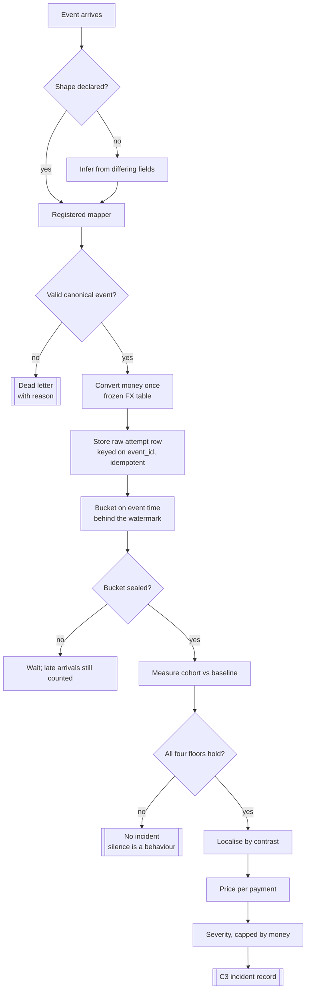
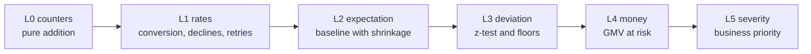
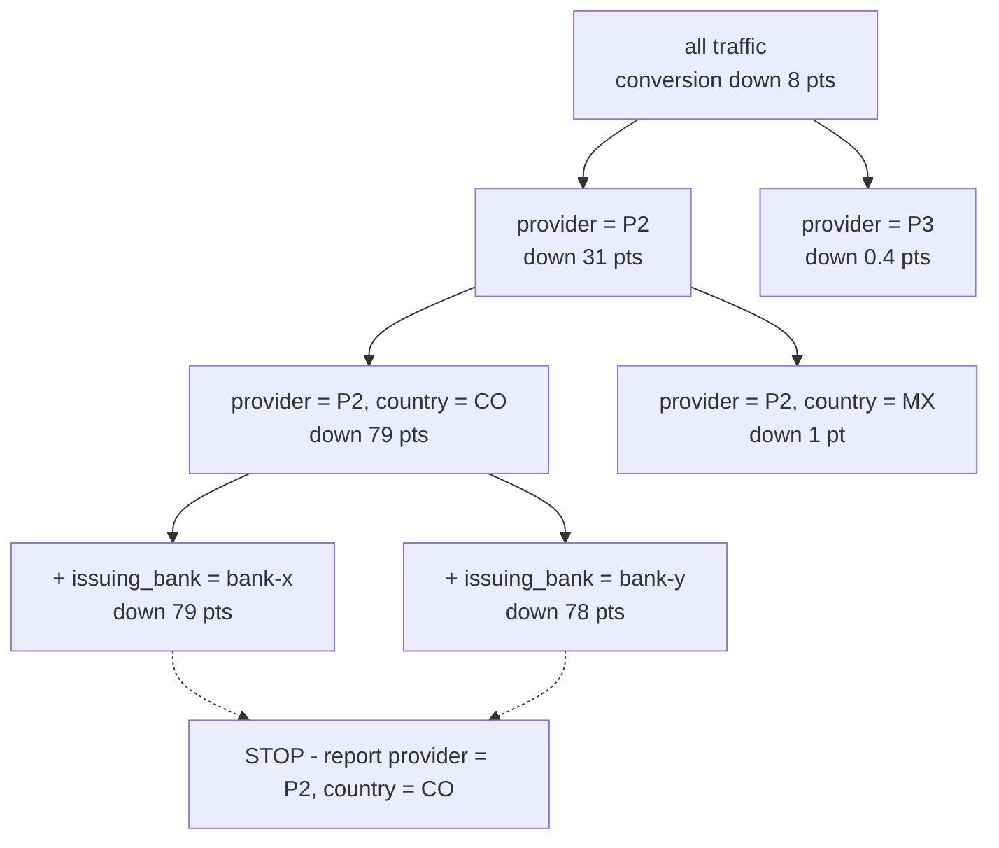
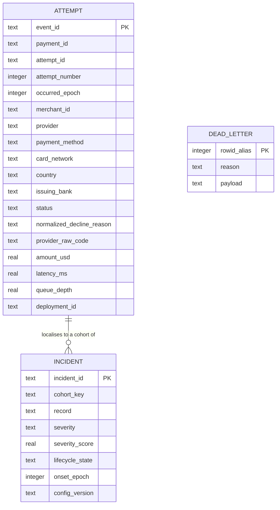

# L3 - Detection plane

The deterministic half of the Control Tower, owned by `andres` as W2. It turns a stream of
heterogeneous merchant events into two things: a measured read surface that investigation and
surfaces query, and a small ranked set of incident records with money attached.

Nothing in this layer calls a language model. It establishes **what happened and what it costs**.
It never decides **why**, and there is no field in its output for a cause, a hypothesis or a
confidence.

The decisions behind everything below are recorded as [ADRs 0013 to 0019](adr/README.md). The
contracts are [C1b canonical event](contracts/canonical-event.md), [C2 evidence
tools](contracts/evidence-tools.md) and [C3 incident record](contracts/incident.md).

## Where it sits

```mermaid
flowchart LR
    subgraph L1["L1 - merchants (W1)"]
        Native["Native per-merchant shapes<br/>registered, heterogeneous"]
        Truth[("Hidden ground truth<br/>quarantined")]
    end

    subgraph L3["L3 - detection plane (W2)"]
        Map["Mapper registry<br/>native to canonical"]
        Canon["C1b canonical event"]
        Store[("SQLite<br/>attempts + incidents")]
        Measure["Measurement<br/>conversion, declines, retries, ops"]
        Detect["Detection<br/>baseline, z-test, four floors"]
        Local["Localisation<br/>descend on contrast"]
        Price["Impact<br/>GMV at risk per payment"]
        Sev["Severity<br/>business impact only"]
        C2["C2 evidence tools"]
        C3["C3 incident record"]
    end

    subgraph L4["L4 - investigation (W3)"]
        Agent["Constrained agent"]
    end

    subgraph L5["L5 - surfaces (W4)"]
        UI["Dashboard and escalation"]
    end

    Native --> Map --> Canon --> Store
    Store --> Measure --> Detect --> Local --> Price --> Sev --> C3
    Measure --> C2
    C3 --> Agent
    C2 --> Agent
    C3 --> UI
    C2 --> UI
    Agent --> UI
    Truth -. no read path .-x L3
```



The quarantine is not a convention this layer respects; it is the absence of a path. Detection has
no reader for hidden ground truth and asks for none.

## The pipeline



## The measurement ladder

Every rung is deterministic and inspectable. Walking back down it is the answer to "why did it say
that".



### L1 - the rates

| Metric | Definition | What it tells us |
|---|---|---|
| `payment_approval_conversion` | approved payments / attempted payments | the headline; what the business loses |
| `attempt_approval_conversion` | approved attempts / attempts | what the provider surface is doing |
| `retry_amplification_factor` | attempts / payments | the fingerprint of a retry storm |
| decline mix | share of each normalised reason over failed attempts | provider fault versus issuer fault |
| error and timeout rate | errors or timeouts / attempts | separates "declined" from "broke" |
| latency p50, p95, p99 | exact, from stored samples | degradation often shows here first |

Within a cohort filter, a payment counts as approved only if it was approved **through that
cohort**. A payment that failed on provider P2 and then succeeded on P3 is a failure in the P2
slice and a success in the P3 slice. That is what makes the gap between the two conversion levels
meaningful: attempt conversion falling while payment conversion holds means the fallback is
absorbing a failure, and both falling together means money is leaving.

### L2 - the baseline

Expected conversion comes from a trailing window on the same cohort, shrunk toward the parent
cohort by sample size. The shrinkage is what stops an eight-payment cell from producing a wild
expectation and screaming.

This is deliberately the crude version. The contextual hour-of-week profile replaces it as soon as
replayable backfill history exists; a seasonal baseline cannot be learned from the minutes before an
incident, and an honest crude baseline beats a fabricated seasonal one.

### L3 - the deviation

A drop qualifies only when all four floors hold together ([ADR 0013](adr/0013-detection-floors-not-a-single-threshold.md)):

```
z <= -Z_MIN                    statistically real
expected - actual >= ABS_MIN   operationally meaningful
payments >= N_MIN              enough traffic to be sure
sustained >= K buckets         not a one-minute blip
```

### L4 - the money

```
expected_approved_value = attempted_value x expected_conversion
gmv_at_risk             = expected_approved_value - actual_approved_value
loss_per_hour           = gmv_at_risk / window_hours
```

Priced per payment, never per attempt ([ADR 0017](adr/0017-value-is-priced-per-payment.md)), and
labelled GMV at risk rather than platform revenue. Every response carries its assumptions.

### L5 - the severity

Four components, then a money ceiling ([ADR 0014](adr/0014-severity-is-bounded-by-money.md)):

```
impact      = log10(1 + loss/floor) / log10(1 + cap/floor)
radius      = affected payments / platform payments
persistence = buckets sustained / full
trajectory  = +1 worsening, 0 flat, -1 recovering

score   = 0.55 impact + 0.20 radius + 0.15 persistence + 0.10 trajectory
band    = threshold lookup, then capped by the loss-rate ladder
```

`severity_of()` takes no statistical argument. There is no parameter through which evidence
strength could reach it, which is why a critical severity with low diagnostic confidence is valid
and required output.

## Localisation

The interesting part. Detection must name where a degradation lives without a catalogue of incident
types and without materialising the full cross product of six dimensions.



At each level we compare **siblings**, not depth. Provider separates cleanly, so it enters the
cohort. Country separates cleanly, so it enters too. The two issuing banks are equally degraded, so
the issuer discriminates nothing and the descent stops - reporting a bank there would be a
coincidence dressed up as a diagnosis.

Both obvious alternatives fail, and both failed in practice before this rule replaced them
([ADR 0015](adr/0015-localisation-descends-on-contrast.md)):

| Ranking rule | Failure |
|---|---|
| by absolute drop | over-specifies: noise inside an already-collapsed cohort beats the parent, so an innocent issuing bank joins the incident |
| by z-score | under-specifies: z grows with sample size, so the diluted parent always wins and every incident reads "everything is a bit down" |
| by sibling contrast | reports the most specific cohort the evidence supports |

Nothing about any particular path is encoded, only the rule for descending one. That is why a
dimension combination nobody anticipated is still located, and it is why sensitivity is tuned in
config while the search space is never narrowed.

## Storage



Relational and embedded: one file, no daemon, no container between the team and a working demo, and
the file itself is evidence a judge can be handed. Drill-down is a `GROUP BY` over `attempt`, which
is what allows arbitrary depth without pre-materialising anything.

## Why an agent can trust these numbers

Five properties, each demonstrable on demand.

| Property | Mechanism |
|---|---|
| Replay equals live | every bucket, window and onset is computed from event time behind a watermark ([ADR 0016](adr/0016-event-time-bucketing.md)); the same log replayed produces an identical incident |
| Closed question space | the agent asks only the published C2 tools over a fixed dimension set; its exploration is free, its facts are not |
| Every number is addressable | each response carries a `query_id` derived from the exact `{tool, input}`, so any claim can be re-run and reproduced |
| Thresholds are versioned config | `CONFIG_VERSION` travels with every incident, so "why did it fire" is always answerable |
| Bounded, terminating search | fixed maximum depth, a separation floor and a volume floor; the descent cannot loop and cannot run long |

The practical consequence: the agent can be creative about which questions to ask and how to weigh
the answers, while every fact underneath is frozen. If the model has a bad night, the incident, the
cohort and the money are still correct on screen.

## Behaviours held by tests

`make test` covers the graded behaviours rather than the implementation.

| Behaviour | Why it is graded |
|---|---|
| healthy traffic raises no incident | not firing on noise is the first thing a judge sees |
| a provider degradation localises to exactly the injected cohort | the diagnosis must be specific |
| a provider degraded everywhere is reported as the provider alone | over-specification is a wrong answer, not a precise one |
| payment and attempt conversion measurably diverge under retries | the retry-awareness requirement |
| value is not inflated by a retry storm | the money figure is quoted live |
| a large merchant's small shift outranks a tiny cohort's dramatic one | the explicit ranking case in the product baseline |
| confounding is detected, and absent when dimensions do separate | honest uncertainty in both directions |
| replaying the same events in a different order gives an identical incident | determinism is the basis of every other claim |
| both known source shapes normalise to the same canonical row | nobody who built to either has to redo it |
| an unregistered shape, currency or decline reason is refused | a visible rejection beats a silently wrong count |

## Current state and what is next

Landed: the canonical model and its mapper registry, the SQLite store, measurement, the baseline,
detection, localisation, impact, severity, the C3 record, and a CLI.

Next, in order:

1. Wire the ten published C2 tools to real measurement in place of their fixtures, keeping the
   stdin/stdout protocol and the `query_id` algorithm exactly as published.
2. Agree and implement the incident trigger. The C3 record's shape is specified, but nothing yet
   defines how an incident reaches investigation - see the open item in `STATUS.md`.
3. Replace the trailing-window baseline with the contextual hour-of-week profile once replayable
   backfill history exists.

Two open seams, both raised in `STATUS.md`:

- **C2 has no time-series tool.** No published tool returns a metric over a series of buckets, yet
  C3 requires an `onset`, severity needs a trajectory, and the demo has to answer "since when".
  `detector/metrics.timeseries` implements it and is tested; whether it becomes an eleventh tool or
  folds into `cohort_metrics` is a contract decision.
- **Nothing defines what starts an investigation.** The agent runtime is decided, its trigger is
  not.
