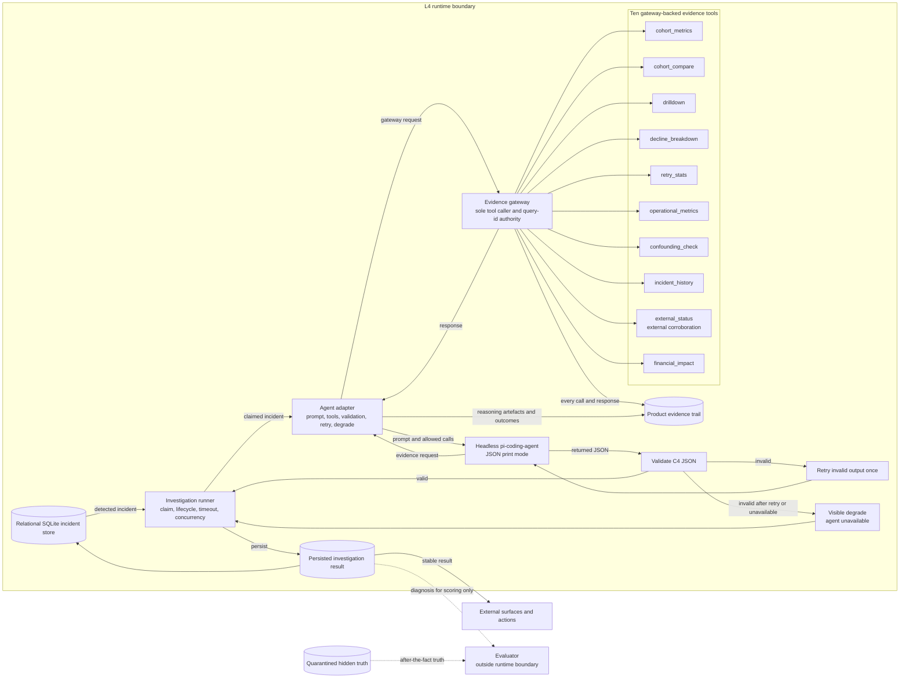

# L4 Investigation component PRD

**Layer identity:** L4 is the Investigation layer, owned by `derek` and corresponding to workstream W3. The layer sequence is L1 merchant emission, L2 ingestion and normalisation, L3 deterministic detection, L4 investigation, and L5 surfaces and escalation.

The conceptual flow is:

> deterministic detection -> structured evidence -> bounded investigation -> structured incident assessment -> external surfaces and actions

## Purpose and scope

A Technical Account Manager needs more than an alert that payment conversion changed. L4 investigates an already-detected incident, compares plausible causes using observable evidence, explains what can and cannot be concluded, and recommends what the TAM should investigate or do next. It turns a deterministic incident and a bounded evidence search into a defensible incident assessment.

L4 is not an automatic remediation system. Its scope is bounded causal investigation and operator-facing explanation. It must serve provider, issuer, method, geography, retry, application, infrastructure, and combined-dimension incidents through one general path.

## Responsibilities

L4 owns:

- hypothesis generation and ranking;
- evidence selection and bounded querying;
- interpretation of uncertainty and deterministic confounding;
- diagnostic confidence;
- missing-evidence identification;
- recommendations;
- the operator-facing narrative; and
- the evidence trail.

Outside the runtime path, L4 also owns the scenario catalogue and the evaluator.

L4 explicitly does **not** own metric computation, baselines, severity, financial arithmetic, cohort localisation, incident lifecycle state, or the severity-to-channel escalation binding. L4 cites these; it never derives them. Detection establishes what happened and what it costs. Investigation determines why it probably happened and what to do next.

## Inputs

L4 receives:

1. **The incident record (C3).** This is the deterministic Detection output, including the affected cohort, measured change, persistence, blast radius, financial impact, severity, lifecycle state, and the drill-down path already computed by Detection.
2. **The evidence-query surface (C2).** This provides ten tools: `cohort_metrics`, `cohort_compare`, `drilldown`, `decline_breakdown`, `retry_stats`, `operational_metrics`, `confounding_check`, `incident_history`, `external_status`, and `financial_impact`.
3. **Historical incidents** for the merchant or cohort, queried through the evidence surface.
4. **External provider health**, queried through the evidence surface as optional corroboration.
5. **Business-impact figures** arriving as cited facts on the incident and evidence responses. L4 never recomputes them.

Diagnostic confidence and ambiguity assessments are **not inputs**. They are outputs of this layer. No pre-computed evidence bundle arrives from Detection: Detection supplies its deterministic drill-down path, while Investigation selects and assembles the evidence it needs.

## Processing flow

1. An incident enters the store in `detected` state.
2. The investigation runner claims it, enforcing concurrency and the wall-clock timeout.
3. The evidence gateway executes the fixed opening set: cohort metrics, sibling comparison, decline breakdown, retry statistics, operational metrics, confounding check, and financial impact.
4. The agent receives the incident facts and those opening results. It may request at most the configured query budget in further bounded queries.
5. The agent emits a structured investigation result.
6. The agent adapter validates the result against the C4 contract. If output is invalid, it retries once. If it remains invalid, or the agent is unavailable, the run degrades to a result with an explicit unavailable narrative rather than dropping the incident.
7. The runner persists the result, evidence trail, outcome, version, and timing. The incident then moves to `diagnosed`, including when the outcome is a visible degraded outcome.

Hypotheses are supported by cited results that are consistent with them and ranked by the agent. A hypothesis is eliminated only under the rule in ADR 0007: the result must cite evidence whose result contradicts that hypothesis. Without such a contradiction, it remains `not ruled out` or the result states that the evidence `cannot distinguish` the competing explanations.

## Internal components - three, and no more

### Investigation runner

**Single responsibility:** claim incidents, enforce lifecycle, concurrency, query-budget and wall-clock limits, persist results, and manage the transition from `detected` to `diagnosed`.

It does not reason about causes and does not call evidence tools directly.

### Evidence gateway

**Single responsibility:** be the only caller of the ten evidence tools, assign every query id, record every call and response to the evidence trail, and apply per-tool timeouts.

It holds no domain logic and makes no judgements. External corroboration is the `external_status` tool behind this gateway, not another component.

### Agent adapter

**Single responsibility:** build the investigation prompt, expose only gateway-backed tools to the headless agent, validate returned JSON, retry invalid output once, and produce the deterministic degrade result when necessary.

It computes nothing. The headless agent has no built-in shell, file-read, edit, or write tools and cannot access raw events or the evaluator.

The evaluator is deliberately **outside** this runtime path and has no read path into it. It runs after the fact against the hidden truth and a produced diagnosis. Making an evaluator reachable from the diagnostic path would let ground truth leak into diagnosis and would turn the demonstration into a scripted result.

## Data contracts

Detection to Investigation is C3, and Investigation to downstream consumers is C4. The authoritative definitions are [`docs/contracts/incident.md`](contracts/incident.md) and [`docs/contracts/investigation-result.md`](contracts/investigation-result.md). The C2 evidence-query surface is authoritative in [`docs/contracts/evidence-tools.md`](contracts/evidence-tools.md).

The contracts describe shape; the following split makes provenance explicit for every part of C4:

| C4 part | Provenance and meaning |
| --- | --- |
| `incident_id` | Deterministic reference carried through from C3. It is not an agent interpretation. |
| `confirmed_facts` | Agent-selected statements about deterministic observations. The observations are carried through from C3 or C2 and every statement must cite them; the selection and wording are agent interpretation. |
| `leading_hypothesis` | Agent-generated causal interpretation, supported by citations to C2 evidence. It is not a Detection fact. |
| `supporting_evidence` | Agent-selected interpretation of which cited C2 results support the leading hypothesis. The underlying measurements are deterministic tool responses. |
| `competing_explanations` | Agent-generated plausible causal interpretations, each grounded in cited evidence. They are not supplied as diagnoses by Detection. |
| `why_ambiguity_exists` | Agent-generated explanation of the uncertainty, grounded in the deterministic `confounding_check` or other cited results. The structural confounding fact itself is carried through from Detection/C2. |
| `missing_evidence` | Agent-generated identification of the absent discriminating observation and why it is needed, with citations to the evidence that exposed the gap. |
| `diagnostic_confidence` | Agent-generated assessment of causal evidence strength. It is never supplied by Detection. |
| `recommended_next_action` | Agent-generated advisory interpretation of what to investigate or do next, with a cited basis. It is not an automatically executed remediation. |

Evidence items within these parts carry deterministic query ids assigned by the gateway. A query id is a citation to a tool call and response, not a claim that the agent may invent. Severity never appears in C4. Diagnostic confidence never appears in C3.

## Evidence trail

Every investigation stores a complete, human-inspectable trail containing:

- every query's id, tool, parameters, response, timestamp, duration, and outcome;
- the hypotheses considered;
- each eliminated hypothesis and the citation that eliminated it;
- each hypothesis that remains and why the evidence cannot separate it from alternatives;
- the confidence assigned and its basis;
- corroboration attempts, including failures and unavailable external sources; and
- the agent's returned reasoning artefacts, including the structured assessment and validation/degrade outcome.

The trail is a **PRODUCT SURFACE**, not an application log. It is rendered for a human and is what makes the diagnosis defensible under questioning. A human must be able to inspect the evidence path behind a claim without relying on internal runtime logs.

## Outputs

L4 emits one stable structured investigation result, plus the incident it references. Downstream external surfaces consume that structure and never need to understand L4 internals.

L4 does not decide who gets notified. Severity drives channel binding and L5 owns that binding. The evidence trail is exposed as a readable view for the dashboard.

## Persistence and query behaviour

L4 reads and writes the relational SQLite store only. It consumes no Kafka, has no consumer group, and maintains no offsets. Incidents are polled by lifecycle state. The agent never receives raw events; all observational data reaches it through the C2 evidence gateway.

The store persists the investigation result, full evidence trail, outcome state, result version, and timing. Persistence makes the layer restartable mid-demo without losing a diagnosis or the evidence that supports it.

V1 runs one investigation per incident and versions its result. A manual re-run creates a new version. Automatic re-investigation triggers remain an open decision.

## Failure and insufficient evidence

The four legal outcomes are:

- `diagnosed`: evidence supports a bounded leading explanation;
- `ambiguous`: multiple explanations remain plausible and the evidence cannot distinguish them;
- `insufficient_evidence`: available observations do not support a useful causal assessment yet; and
- `agent_unavailable`: the runtime or returned output is unavailable after the allowed recovery path.

An incident is never dropped because investigation failed. For `agent_unavailable`, its deterministic incident facts, localisation, financial impact, and evidence still render, while the narrative is explicitly marked unavailable. This is a visible degrade, never a silent one.

For the high-impact, low-evidence case, priority remains critical because severity comes from Detection. The result names each competing explanation, explains precisely why they cannot be separated, identifies the missing evidence, and recommends the discriminating investigation to run. It recommends investigation, never an unapproved remediation. Low diagnostic confidence never reduces severity.

## Demo path

The same path handles each guaranteed scenario end to end:

1. **Provider degradation.** Detection supplies the affected cohort, deterministic localisation, severity, and financial impact. The opening metrics, sibling comparison, decline breakdown, retry statistics, operational metrics, and optional provider status let the agent rank provider degradation when first-party observations discriminate it. The result cites the relevant observations and recommends the next operator action.
2. **Confounded provider-versus-issuer case.** The same opening set includes the deterministic cross-tabulation. The agent explains that provider and issuer are structurally inseparable in the observation window, keeps both explanations, assigns appropriately low or medium diagnostic confidence, names the missing comparison, and recommends gathering that evidence rather than pretending to know the cause.
3. **High-impact small-percentage change.** Detection carries the large merchant's financial impact and critical severity even when the percentage shift is small. Investigation uses the same evidence path to explain the observed change and keeps diagnostic confidence independent from business priority.

These materially different outputs require no scenario-specific branch. In accordance with ADR 0012, the agent is never told which scenario is running, no scenario identifier reaches this layer, and no diagnosis is hardcoded. The agent is never the source of truth: deterministic Detection and cited evidence establish observations, while the agent interprets them within the bounds above.

## Component architecture

The gateway is the only path to all ten evidence tools, including external corroboration. The evaluator has no edge into the runtime boundary; it cannot influence a prompt, query, result, or diagnosis.

## Open decisions

Only these decisions remain unresolved:

1. Whether automatic re-investigation should trigger on a severity-band change or material blast-radius growth.
2. The query budget value. Six further queries is the current starting value, chosen to bound latency and cost, and will be tuned with evidence.

Both are working defaults chosen by firstmate, not decisions settled by the captain.
